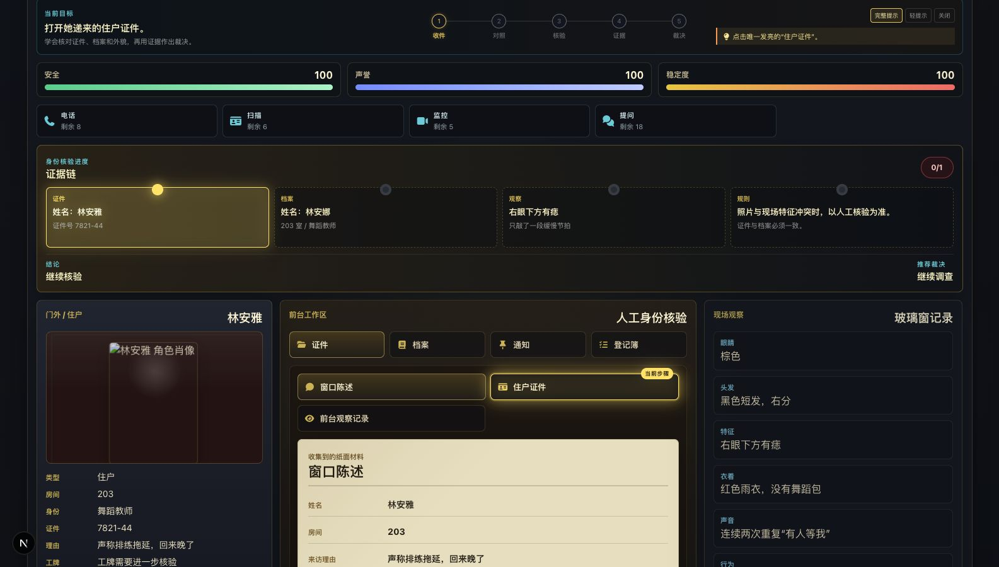
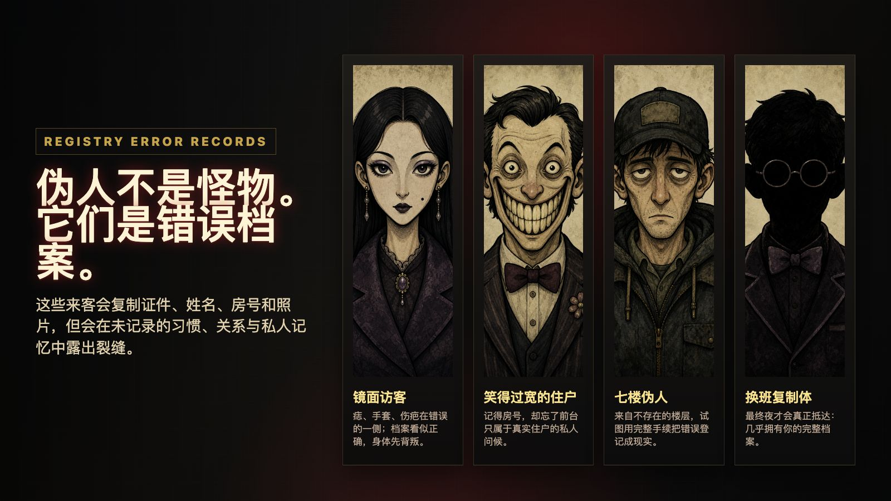

# Midnight Registry


**A Chinese-first night-desk horror verification game where every stamp decides who gets to exist.**

Midnight Registry is a Chinese-first Next.js prototype for a night-desk identity verification horror game set in Moonshadow Apartments. The player works as a temporary door clerk, compares visitor claims against resident records, and decides whether each person should be allowed in, refused, held for more investigation, or escalated to security.

The older Pocket Town Companions direction is archived. This repository now tracks Midnight Registry as the active playable prototype and reusable design-system source.

## Preview



The core desk loop puts the current objective, evidence chain, visitor, archive materials, verification tools, and final verdict buttons on one tense screen.



Impostors are not generic monsters. They are registry error records that can copy paperwork, but break down when questioned about private habits, relationships, and memories.

## Game Premise

Every visitor check is a reality-recording action. Impostors are not generic monsters; they are registry error records trying to be formally logged so they can occupy a real resident's identity and erase the original from reality. They can copy documents and recorded facts, but they struggle with private routines, relationships, greetings, habits, and memories that were never written down.

The intended long arc is a seven-night desk shift. The current MVP focuses on the first three nights while foreshadowing later archive corruption, Blue Star Repair work orders, unreliable management, and the final clerk-duplicate confrontation.

## Playable Scope

The current build is a 3-night demo with authored visitor cases:

- 10 resident records for archive comparison.
- 8 visitor checks per night.
- Four final decisions: allow entry, refuse entry, call security, or hold/wait.
- Directed first-night onboarding for documents, resident files, appearance mismatches, evidence marking, and security escalation.
- Chinese player-facing story, rules, visitor text, tool results, summaries, and endings.
- Reusable character, prop, UI, rule, error-detail, and nightly encounter assets.

## Core Verification Loop

1. Inspect the visitor's presented identity, reason for entry, room, time, and documents.
2. Compare the claim against resident archive details, appointments, notices, nightly rules, and entry logs.
3. Use verification tools such as phone calls, CCTV checks, ID scanning, question prompts, and evidence marking.
4. Choose allow, refuse, security, or hold/wait only after enough evidence is collected.
5. Resolve the case and carry the consequences into the night's safety, sanity, reputation, and story state.

Hold/wait is an investigation branch, not a passive delay. It can unlock callbacks, CCTV contradictions, changing files, or visitor reactions before the player makes a second ruling.

## Routes

- `/` - playable Midnight Registry demo.
- `/design-system` - reusable Midnight Registry component and asset reference.
- `/animation-debug` - animation and feedback test surface for selected effects.

## Tech Stack

- Next.js App Router
- React
- TypeScript
- Global CSS in `styles/globals.css`
- Font Awesome icons
- Storybook for the reusable Midnight Registry design system

## Local Development

Install dependencies once:

```bash
npm install
```

Run the playable prototype:

```bash
npm run dev
```

Run validation checks:

```bash
npm run lint
npm run build
npm run verify:assets
npm run build-storybook
```

Run Storybook locally:

```bash
npm run storybook
```

## Project Structure

- `app/` - Next.js routes for the playable game, design-system page, and animation debug page.
- `components/midnight/` - Midnight Registry game UI, animation debug UI, and reusable design-system components.
- `data/midnightRegistryData.ts` - resident records, visitor cases, decision labels, and core game data.
- `data/midnightRegistryExperience.ts` - nightly experience data, tutorial steps, CCTV behavior, prep cards, and evidence thresholds.
- `data/midnightRegistryDesignSystem.ts` - reusable asset, rule, encounter, ending, and handoff data.
- `lib/midnightRegistryZh.ts` - Simplified Chinese presentation text and localized registry details.
- `lib/midnightAudio.ts` - sound effect helpers and ambience references.
- `public/assets/midnight-registry/` - generated characters, props, CCTV stills, prep desk items, audio, and review sheets.
- `stories/` - Storybook entry for the Midnight Registry design system.
- `docs/` - gameplay plans, QA notes, deployment notes, and design handoff documentation.
- `supabase/` - placeholder database notes for future persistence work.

## Assets

Midnight Registry assets are intended to be reusable game materials rather than static reference art. Character portraits use uniform `512 x 768` canvases, while props, tools, and clues use uniform `512 x 512` canvases. Contact-sheet images are kept in `public/assets/midnight-registry/` for review, and individual exports should stay clean of labels, borders, filename strips, and neighboring artwork.

Run the asset verifier after changing generated assets:

```bash
npm run verify:assets
```

## Deployment

The prototype is static from the app's point of view and does not require Supabase environment variables. Vercel can deploy it with the default Next.js settings. See `docs/deployment.md` for the short deployment checklist.

## Supabase

Supabase is not required for the current playable build. `supabase/schema.sql` is a placeholder for a future Midnight Registry data model when persistence, player runs, or shared content are added.
