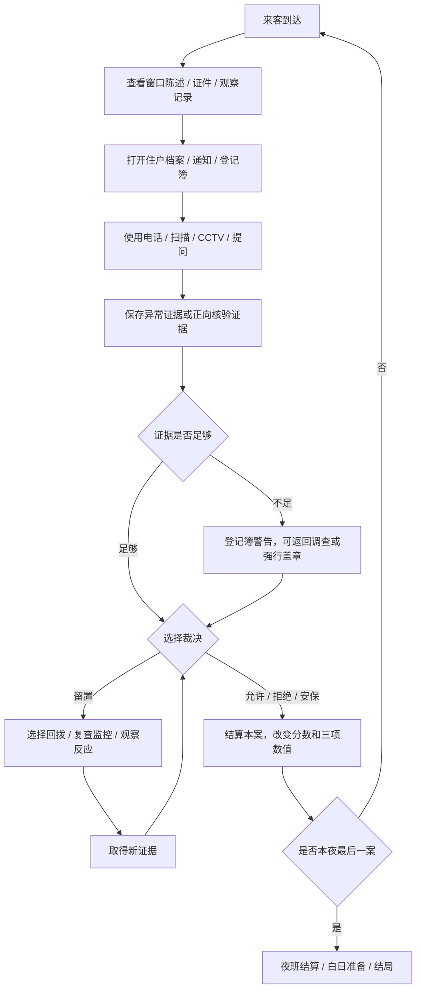

# 《午夜登记簿》完整剧情与程序结构报告

生成日期：2026-06-14
适用项目：`/Users/yongjiexue/Documents/pet_town`
当前实现口径：七夜故事模式，68 个可玩来访案例，主游戏可见文本以简体中文为准。

## 1. 报告目的

本文把《午夜登记簿》的完整剧情设定、七夜案件、结局逻辑和程序结构整理成一份统一报告，方便后续继续做内容、程序、设计系统、测试和交接。

当前项目已经不再是 Pet Town 或 Pocket Town Companions。可见主线是《午夜登记簿》：玩家扮演月影公寓临时夜班门岗薛夜，在七个夜晚中处理来客核验，通过证件、档案、电话、CCTV、提问、规则和登记簿判断身份，并用允许、拒绝、呼叫安保、留置等待四种处理方式决定现实如何被记录。

## 2. 核心定位

### 2.1 游戏类型

《午夜登记簿》是一个旧公寓夜班门岗身份核验恐怖游戏。

它的核心体验不是战斗或逃跑，而是人工核验：

1. 来客站在玻璃外。
2. 玩家查看纸面材料。
3. 玩家打开住户档案、规则、预约和出入登记。
4. 玩家使用电话、扫描、CCTV、提问等工具交叉确认。
5. 玩家把矛盾或正向核验保存为证据。
6. 玩家盖下允许、拒绝、安保或留置印章。
7. 登记簿把这次裁决写入现实。

### 2.2 核心恐怖设定

门外的冒名者不是普通怪物，而是“登记错误记录”。

它们需要一个正式盖章，才能被登记簿承认为现实中的人。一旦玩家错误放行，复制体会占据真实住户的身份，真实住户可能从档案中消失、被困在楼外，或被所有人遗忘。

它们能复制证件、编号、档案和已经写下来的事实，却难以复制没有被系统记录的细节：

1. 私人习惯。
2. 称呼方式。
3. 关系记忆。
4. 日常动作。
5. 未写入档案的小秘密。
6. 真正住户对旧事的自然反应。

所以游戏的核心判断原则是：纸面身份只能证明“记录看起来像真的”，私人记忆和多来源矛盾才能证明“这个人是否仍然是本人”。

### 2.3 四种裁决的叙事意义

| 裁决 | 玩法含义 | 剧情含义 |
|---|---|---|
| 允许进入 | 放行真实住户或授权访客 | 把对方正式写入今晚现实 |
| 拒绝进入 | 阻止普通身份不符者 | 在错误记录生效前关闭入口 |
| 呼叫安保 | 处理高危身份覆盖、复制声音、危险名单、最终复制体 | 把对方登记为威胁，而不是住户 |
| 留置等待 | 暂缓裁决，选择回拨、复查监控或观察反应 | 让现实暂停几秒，等待记录自己暴露 |

留置不是“跳过”。当前实现中，留置会打开调查分支，玩家必须选择等待回拨、复查监控或观察反应，然后再做二次裁决。

## 3. 世界观与主线

### 3.1 场景

故事发生在月影公寓。它是一栋旧公寓，楼层、档案、住户关系和物业系统都带有明显年代感。门岗桌面上有登记簿、旧电话、住户档案、监控终端、印章和每日通知。

玩家所在的前台不是普通保安室，而是登记系统的现实入口。每一个印章都不是简单门禁操作，而是在决定“谁可以被承认为存在”。

### 3.2 玩家身份

玩家角色是薛夜，临时夜班门岗。

起初薛夜只是被雇来代班，但主线逐步揭示：

1. 月影公寓过去发生过整栋楼登记错误。
2. 已注销十二年的蓝星维修仍在生成工单。
3. 物业和外部系统并不可靠。
4. 住户档案会被污染和改写。
5. 复制体会学习玩家常用的核验流程。
6. 薛夜自己的档案状态变成“等待替换”。
7. 第七夜，第二个薛夜带着几乎完整的文件来换班。

### 3.3 主题

本作主题是“身份不是证件，而是被记住的生活”。

纸面材料越完整，玩家越需要怀疑它。真正可靠的东西是住户之间的关系、生活习惯、未记录记忆，以及多个独立来源之间能否互相支持。

## 4. 主要角色与身份素材

### 4.1 十名核心住户

| 住户 | 房间 | 职业 | 可靠核验点 | 常见伪造破绽 |
|---|---:|---|---|---|
| 林安娜 | 203 | 舞蹈教师 | 左眼下痣、黑色舞蹈包、快速敲两段节拍、从不穿红色 | 姓名变成林安雅、痣在右边、穿红衣、节拍错误 |
| 周启明 | 506 | 退休警员 | 右手黑手套、回答简短、不笑点头 | 左手手套、话太多、声称忘带钥匙 |
| 李梅 | 302 | 花店店员 | 左手银手链、抱花、走楼梯、不接受“阿姨”称呼 | 右手手链、按电梯、自称李阿姨 |
| 陈睿 | 410 | 急诊医生 | 左眉细疤、会先报当天日期、医院夜班排班 | 疤在右眉、报错日期、说不出病区 |
| 赵峻 | 104 | 会计 | 圆框眼镜、皮质文件夹、主动问邮件登记簿 | 没带文件夹、不问登记簿、动物访客 |
| 王玉兰 | 601 | 退休图书管理员 | 月牙柄黄铜手杖、前台只说普通话、旧钥匙 | 说英语、提到七楼、长辫肩侧错误 |
| 朴米娜 | 208 | 美术学生 | 蓝色颜料围巾、星号签名、手上有颜料 | 干净双手、星号擦除、房号 280 |
| 孙浩 | 315 | 夜班厨师 | 右拇指烫伤、三下敲门、会给前台留包子 | 烫伤缺失或错边、敲门次数错误、知道包子但没有生活痕迹 |
| 郭岚 | 402 | 裁缝 | 软尺、窄袖、会扶正衣领、称大楼旧名 | 宽袖、不会处理袖口、不用旧名 |
| 徐欧文 | 502 | 小提琴手 | 银色琴盒搭扣、说话前轻哼、绝不让别人拿琴盒 | 黄铜搭扣、说完才哼、要求代拿琴盒 |

### 4.2 重要外来者与威胁

| 角色 | 类型 | 叙事作用 |
|---|---|---|
| 韩东 | 蓝星维修人员 | 引出“已注销公司仍在生成工单”的主线 |
| 莉娜·索尔 | 月影快递员 | 支撑宵禁后包裹留置玩法 |
| 柯仁 | 无授权维修人员 | 第六楼暂停施工规则的危险测试 |
| 镜像访客 | 冒名者 | 体现左右翻转、影子异常、档案镜像污染 |
| 笑面人 | 禁入威胁 | 高危安保级威胁，不能按普通住户处理 |
| 七楼冒名者 | 不可能楼层威胁 | 推进“月影公寓没有七楼”的规则恐怖 |
| 档案员 | 第六夜威胁 | 送来带有薛夜照片的新档案，提前引向最终替换 |
| 前台复制体 | 第七夜最终威胁 | 带着完整证件来替换薛夜 |

## 5. 七夜总剧情

| 夜晚 | 标题 | 核心主题 | 新核验重点 | 案例数 |
|---:|---|---|---|---:|
| 1 | 档案看起来一切正常 | 纸面差异和外貌差异 | 证件、档案、外貌、基础证据 | 8 |
| 2 | 外部系统也会说谎 | 预约和外部工单开始不可靠 | 公司、时间、楼层、预约 | 8 |
| 3 | 同一个人出现在两处 | 电话确认同一身份冲突 | 房间电话、已在楼内、复制声音 | 8 |
| 4 | 住户的私人习惯 | 完美证件不再可靠 | 私人习惯、关系、问候 | 11 |
| 5 | 被污染的档案 | 档案会自行改写 | 独立来源、时间戳、档案修复 | 12 |
| 6 | 它们学会了你的流程 | 复制体学习玩家流程 | 轮换工具、过度完美、关系交叉 | 13 |
| 7 | 等待替换的前台 | 第二个薛夜来换班 | 当前门岗已登记、无换班、无影子 | 8 |

合计：68 个可玩案例。

## 6. 第一夜：档案看起来一切正常

### 6.1 剧情目标

玩家第一次坐上前台，物业只留下值班手册。第一夜的表面目标很简单：核对住户证件和档案。但从第一枚拒绝章开始，登记簿页边墨迹移动，暗示裁决会改变现实。

第一夜前三案是强引导：

1. 林安雅：教学证件与档案姓名差异。
2. 周启明复制体：教学外貌左右差异。
3. 朴米娜复制体：教学电话、CCTV、证据保存与安保级处理。

### 6.2 第一夜规则

1. 20:00 后只允许名单内住户进入。
2. 无证件者一律拒绝。
3. 照片与现场特征冲突时，以人工核验为准。
4. 纸面身份与生活习惯矛盾时，不得盖章登记。

### 6.3 第一夜案件

| 顺序 | 来客 | 声称 | 正确裁决 | 关键证据 |
|---:|---|---|---|---|
| 1 | 林安雅 | 203 室住户 | 拒绝进入 | 姓名错误，痣在右眼下，林安娜从不穿红色 |
| 2 | 周启明复制体 | 忘带钥匙 | 拒绝进入 | 手套戴在左手，话太多，真正周启明不会说忘钥匙 |
| 3 | 朴米娜复制体 | 280 室取速写本 | 呼叫安保 | 房号错误，208 室电话同步重复门外声音，影子消失三帧 |
| 4 | 林安娜 | 排练后回家 | 允许进入 | 姓名、房号、证件、左眼下痣、敲节拍习惯一致 |
| 5 | 周启明 | 打牌后回家 | 允许进入 | 右手黑手套，回答简短，房间电话确认 |
| 6 | 朴米娜 | 画室课后回家 | 允许进入 | 蓝围巾、星号签名、手上颜料、证件一致 |
| 7 | 郭岚 | 客户量体后回家 | 允许进入 | 软尺、窄袖、扶正衣领、使用大楼旧名 |
| 8 | 徐欧文复制体 | 303 投诉练琴 | 拒绝进入 | 证件号错一位，琴盒搭扣应为银色，徐欧文绝不让别人拿琴盒 |

### 6.4 夜半事件与结尾

夜半事件：登记簿页边渗出新墨迹，像是在记录玩家的检查顺序。
结尾钩子：拒绝章干透后，一行旧住户记录自己换了位置。

## 7. 第二夜：外部系统也会说谎

### 7.1 剧情目标

第二夜开始，外部资料不再可靠。蓝星维修出现在今晚工单里，但旧工商档案显示这家公司十二年前已注销。玩家必须核对预约、公司、时间、楼层和第二来源。

### 7.2 第二夜规则

1. 22:00 后外卖不得进楼。
2. 今晚暂停所有六楼维修。
3. 忘带钥匙必须通过房间电话确认。
4. 21:00 后出现的蓝星维修必须取得第二来源证明。

### 7.3 第二夜案件

| 顺序 | 来客 | 声称 | 正确裁决 | 关键证据 |
|---:|---|---|---|---|
| 1 | 韩东 | 20:30 蓝星维修四楼配电箱 | 允许进入 | 预约、时间、公司、四楼任务匹配，工具箱封条一致 |
| 2 | 韩东复制体 | 23:30 维修高层线路 | 拒绝进入 | 公司写成蓝心维修，时间错误，声称七楼，蓝星已注销 |
| 3 | 李梅 | 带花回 302 | 允许进入 | 左手手链、抱花、拒绝电梯、楼梯监控一致 |
| 4 | 李梅复制体 | 要求按住电梯 | 拒绝进入 | 手链在右手，李梅从不用电梯，不接受“阿姨”称呼 |
| 5 | 莉娜·索尔 | 宵禁后送 302 药品包裹 | 留置等待 | 快递真实，药品包裹真实，但规则要求留在前台等待 302 回电 |
| 6 | 赵峻 | 审计后忘带钥匙 | 允许进入 | 房间电话确认，皮质文件夹和邮件登记簿习惯一致 |
| 7 | 王玉兰 | 从庙会回 601 | 允许进入 | 住户本人，月牙手杖一致，六楼维修禁令不影响住户 |
| 8 | 柯仁 | 检查六楼通风口 | 呼叫安保 | 无预约，六楼维修暂停，无公司标识，门口监控拍不到身体 |

### 7.4 夜半事件与结尾

夜半事件：街对面短暂亮起褪色的蓝星维修车牌。
结尾钩子：旧工商档案显示，蓝星最后一张工单签发于十二年前的今晚。

## 8. 第三夜：同一个人出现在两处

### 8.1 剧情目标

第三夜开始，核心矛盾变成“同一个身份不能同时在楼内和门外”。玩家必须频繁使用电话确认房间状态。门外的人可能掌握证件和习惯，但楼内电话可能由真正住户接起。

当前最终剧情口径：第三夜不出现实体薛夜复制体，只出现错误换班通知和前台监控单帧异常，避免提前消耗第七夜高潮。

### 8.2 第三夜规则

1. 22:30 后到达者必须致电房间。
2. 若房间确认本人已在楼内，门外来客必须拒绝。
3. 同一声音同时出现在电话与门外，立即呼叫安保。
4. 同一身份不得同时登记在两个位置。

### 8.3 第三夜案件

| 顺序 | 来客 | 声称 | 正确裁决 | 关键证据 |
|---:|---|---|---|---|
| 1 | 陈睿复制体 | 从医院提前回家 | 拒绝进入 | 医院确认陈睿在手术，疤痕在右眉，日期错误 |
| 2 | 孙浩 | 夜班提前结束 | 允许进入 | 三下敲门，右拇指烫伤，包子习惯一致 |
| 3 | 朴米娜复制体 | 回 208 睡觉 | 拒绝进入 | 电话确认本人已在楼上，双手太干净，星号被擦除 |
| 4 | 林安娜 | 列车故障晚归 | 允许进入 | 203 电话确认，无红衣，痣和舞蹈包一致 |
| 5 | 王玉兰复制体 | 去 701 阅览室 | 拒绝进入 | 无七楼，房号错误，前台用英语问候 |
| 6 | 郭岚复制体 | 紧急改衣后回 402 | 拒绝进入 | 宽袖错误，402 电话确认本人已在，工牌午夜重印 |
| 7 | 徐诺亚 | 自称徐欧文兄弟取琴盒 | 拒绝进入 | 无预约，徐欧文没有本地兄弟，琴盒已在 502 |
| 8 | 莉娜·索尔 | 302 药品包裹无人接听 | 留置等待 | 快递真实，包裹真实，但需等 302 确认或按规则留置 |

### 8.4 夜半事件与结尾

夜半事件：物业传真吐出 03:00 换班通知，但管理处否认签发。
结尾钩子：玩家保存一帧异常监控，画面里另一个门岗短暂坐在玩家椅子上。

## 9. 第四夜：住户的私人习惯

### 9.1 剧情目标

第四夜强调“完美证件不等于安全”。复制体能照抄档案，但容易在私人习惯、关系和问候上犯错。玩家必须主动问至少一个私人习惯问题。

### 9.2 第四夜规则

1. 证件完全匹配时，也必须追问一个私人习惯。
2. 行为矛盾优先于干净的扫描结果。
3. 未登记宠物不得进入。
4. 未记录记忆是复制体最难伪造的部分。

### 9.3 第四夜案件

| 顺序 | 来客 | 声称 | 正确裁决 | 关键证据 |
|---:|---|---|---|---|
| 1 | 李梅 | 只走楼梯回 302 | 允许进入 | 拒绝电梯，左手手链正确 |
| 2 | 赵峻复制体 | 遗失皮质文件夹 | 拒绝进入 | 赵峻从不空手回楼，也没有问邮件登记簿 |
| 3 | 陈睿复制体 | 今晚休班 | 拒绝进入 | 排班仍在医院夜班，日期回答错误 |
| 4 | 孙浩 | 夜班厨师回 315 | 允许进入 | 带纸包包子，身上有蒜油味 |
| 5 | 王玉兰 | 返回 601 | 允许进入 | 普通话回答，月牙手杖一致 |
| 6 | 徐欧文复制体 | 要你帮忙拿琴盒 | 拒绝进入 | 徐欧文绝不把琴盒交给别人 |
| 7 | 郭岚 | 紧急量体后回楼 | 允许进入 | 主动修正袖口，使用大楼旧名 |
| 8 | 林安娜复制体 | 声称演出要求穿红衣 | 拒绝进入 | 林安娜从不穿红色 |
| 9 | 牵狗访客 | 自称赵峻访客 | 拒绝进入 | 赵峻从不带动物进楼，今晚无预约 |
| 10 | 伪住户 | 让你随便选房间 | 呼叫安保 | 说不出自己的房号，每次回答都重复上一句 |
| 11 | 朴米娜 | 画室回楼 | 允许进入 | 双手有颜料，星号签名正确 |

### 9.4 夜半事件与结尾

夜半事件：一名住户坚称某段问候从未存在，但关系网还留着旧笔迹。
结尾钩子：住户们开始用相同的停顿回答不同问题。

## 10. 第五夜：被污染的档案

### 10.1 剧情目标

第五夜档案本身开始成为不可靠来源。住户卡会翻页、特征会损坏、状态会改写。玩家不能只凭档案定案，必须交叉核验电话、CCTV 和扫描时间戳，并在白日准备阶段修复档案。

### 10.2 第五夜规则

1. 损坏档案不能单独作为证据。
2. 档案墨迹移动时，必须交叉核验电话和监控。
3. 扫描时间戳可识别重印工牌。
4. 物业说法可能与可靠的人证冲突。

### 10.3 第五夜案件

| 顺序 | 来客 | 声称 | 正确裁决 | 关键证据 |
|---:|---|---|---|---|
| 1 | 档案中的林安娜 | 档案照片正在改变 | 留置等待 | 必须先给房间打电话，档案照片不断闪烁 |
| 2 | 陈睿 | 410 室住户 | 允许进入 | 医院确认休息时间，实时监控中眉疤正确 |
| 3 | 镜像访客 | 203 室住户 | 拒绝进入 | 档案与现场照片都被镜像翻转，房间电话否认 |
| 4 | 王玉兰 | 返回 601 | 允许进入 | 证件日期损坏，但手杖和语言习惯一致 |
| 5 | 韩东复制体 | 紧急维修 | 拒绝进入 | 无维修通知，工牌打印时间 00:00 |
| 6 | 莉娜·索尔 | 302 药品包裹 | 允许进入 | 预约在登记簿恢复，包裹封条一致 |
| 7 | 郭岚复制体 | 返回 402 | 拒绝进入 | 档案说可进入，但电话说本人已在楼上，袖口错误 |
| 8 | 孙浩 | 返回 315 | 允许进入 | 正好三下敲门，右拇指烫伤可见 |
| 9 | 赵峻 | 返回 104 | 留置等待 | 扫描器损坏，房间回电延迟 |
| 10 | 笑面人 | 申请新住户 | 呼叫安保 | 禁入名单命中，笑容宽度异常 |
| 11 | 徐欧文 | 琴盒回 502 | 允许进入 | 琴盒始终没有离手，房间电话确认 |
| 12 | 无名者 | 000 室 | 拒绝进入 | 档案中不存在 000 室住户 |

### 10.4 夜半事件与结尾

夜半事件：档案室抽屉无人打开，203 室卡片从左栏移到右栏。
结尾钩子：玩家刚修复的档案在墨迹干透前又被改写一次。

## 11. 第六夜：它们学会了你的流程

### 11.1 剧情目标

第六夜的复制体会根据玩家最常使用的核验工具进行伪造。如果玩家反复依赖电话、扫描、CCTV 或提问，学习型复制体会给出更完美的假结果。

玩法上，玩家必须轮换工具和提问方式，识别“过度完美”本身也是异常。

### 11.2 第六夜规则

1. 不得只依赖一个习惯答案。
2. 必须轮换提问方式。
3. 午夜后的完美回答本身就是异常。
4. 涉及玩家本人的监控证据必须与出入簿交叉核验。

### 11.3 第六夜案件

| 顺序 | 来客 | 声称 | 正确裁决 | 关键证据 |
|---:|---|---|---|---|
| 1 | 朴米娜复制体 | 用星号签名证明身份 | 拒绝进入 | 已学会习惯，倒影里的手仍在作画 |
| 2 | 李梅 | 带花走楼梯回家 | 允许进入 | 电话、监控和手链三项一致 |
| 3 | 周启明复制体 | 用简短回答证明身份 | 拒绝进入 | 回答完美得像背诵，左手手套 |
| 4 | 伪住户 | 冒充 315 室住户 | 呼叫安保 | 知道包子习惯，却没有拇指烫伤 |
| 5 | 韩东 | 执行蓝星维修预约 | 留置等待 | 预约真实，但房间回电无法确认 |
| 6 | 莉娜·索尔复制体 | 投递快递 | 拒绝进入 | 快递证过期，包裹寄往不存在房间 |
| 7 | 陈睿 | 医院下班回楼 | 允许进入 | 医院工牌和日期一致 |
| 8 | 王玉兰复制体 | 返回 601 | 拒绝进入 | 用普通话提到七楼，长辫肩侧错误 |
| 9 | 郭岚 | 量体后回楼 | 允许进入 | 没被提醒就先纠正玩家袖口 |
| 10 | 徐欧文复制体 | 返回 502 | 拒绝进入 | 说完话才哼歌，琴盒黄铜搭扣 |
| 11 | 档案员 | 送来新档案 | 呼叫安保 | 档案照片是薛夜，没有预约 |
| 12 | 孙浩 | 厨房下班回楼 | 允许进入 | 右拇指烫伤与三下敲门正确 |
| 13 | 林安娜 | 排练结束回楼 | 允许进入 | 多种私人习惯提问仍保持一致 |

### 11.4 夜半事件与结尾

夜半事件：监控显示薛夜离开前台一分钟，但玩家清楚记得自己没有起身。
结尾钩子：登记簿开始提前写下玩家下一步会使用的工具。

## 12. 第七夜：等待替换的前台

### 12.1 剧情目标

第七夜是最终夜。薛夜的档案状态变成“等待替换”。第二个薛夜会在最终案件中带着几乎完整的证件来换班。玩家必须证明当前自己已经在岗，阻止第二份记录覆盖。

最终重点不是证明“门外的人长得不像我”，而是证明“当前前台已经被登记为薛夜”。核心证据来自：

1. 今夜没有换班规则。
2. 000 室不是有效房间。
3. 前台自身 CCTV 仍拍到玩家在桌内。
4. 门外第二个薛夜没有对应倒影。
5. 出入登记簿已经记录薛夜正在值班。
6. 工牌背面有“不得登记第二个自己”的警告。

### 12.2 第七夜规则

1. 000 室不是有效住户房间。
2. 今晚没有任何换班安排。
3. 真正的前台已经登记为当班。
4. 不得登记第二个自己。

### 12.3 第七夜案件

| 顺序 | 来客 | 声称 | 正确裁决 | 关键证据 |
|---:|---|---|---|---|
| 1 | 林安娜 | 返回 203 | 允许进入 | 真实住户，记得第一夜未写入档案的细节 |
| 2 | 周启明 | 返回 506 | 允许进入 | 右手手套与房间电话一致 |
| 3 | 七楼冒名者 | 维修七楼设备 | 呼叫安保 | 楼层不存在，危险名单命中 |
| 4 | 镜像访客 | 203 室住户 | 拒绝进入 | 第一夜出现过的左右颠倒特征再次出现 |
| 5 | 王玉兰 | 返回 601 | 允许进入 | 旧钥匙与语言习惯一致 |
| 6 | 伪住户 | 申请登记为新住户 | 拒绝进入 | 第一夜之前从未存在这份住户档案 |
| 7 | 莉娜·索尔 | 最后一份药品包裹 | 留置等待 | 身份真实，但必须留置至结算完成 |
| 8 | 前台复制体 | 接替 000 号夜班 | 呼叫安保 | 文件全对，但无换班、无影子、薛夜已当班、工牌背面警告 |

### 12.4 夜半事件与结尾

夜半事件：安保岗亭无人回应，前台监控同时拍到两个值班轮廓。
结尾钩子：天亮前，登记簿只允许一个薛夜继续存在。

## 13. 结局结构

当前实现有四种结局。

| 结局 | 触发条件 | 剧情结果 |
|---|---|---|
| 好结局 | 阻止最终复制体，镜像放行错误为 0，错误裁决不超过 2，最终分数达到门槛 | 招聘告示上的名字被划掉，薛夜离开登记循环 |
| 幸存结局 | 熬过七夜，但错误较多或分数不足 | 公寓照常运转，但每个人的点头和微笑都比记忆里偏一点 |
| 坏结局 | 放行前台复制体，或安全、声誉、稳定度归零 | 新的薛夜坐在前台内侧，真正薛夜站在雨中敲玻璃 |
| 隐藏结局 | 最终案件中安全、声誉、稳定度都较高，并保存足够证据 | 薛夜借安保警报烧毁登记簿，复制体被删除，自己的楼内记录也消失 |

隐藏结局不是单纯“赢”。它更像切断登记簿路线：阻止复制体进入的同时，也让薛夜从月影公寓历史中被抹去。

## 14. 当前程序结构总览

### 14.1 技术栈

| 层级 | 当前使用 |
|---|---|
| 前端框架 | Next.js App Router |
| UI | React |
| 类型 | TypeScript |
| 样式 | `styles/globals.css` |
| 图标 | Font Awesome |
| 设计系统 | Storybook + `/design-system` 页面 |
| 数据持久化 | 当前为本地静态原型，Supabase 仅有占位 schema |

### 14.2 路由

| 路由 | 文件 | 作用 |
|---|---|---|
| `/` | `app/page.tsx` | 渲染主游戏 `MidnightRegistryGame` |
| `/design-system` | `app/design-system/page.tsx` | 渲染可复用角色、道具、规则、UI、错误详情和夜晚流程资产 |
| `/animation-debug` | `app/animation-debug/page.tsx` | 渲染动画事件调试页 |

### 14.3 主要目录

| 路径 | 作用 |
|---|---|
| `components/midnight/MidnightRegistryGame.tsx` | 主游戏组件，包含准备台、夜班工作台、工具、证据、裁决、结算和结局 |
| `components/midnight/MidnightRegistryDesignSystem.tsx` | 设计系统展示组件 |
| `components/midnight/MidnightAnimationDebug.tsx` | 动画调试组件 |
| `data/midnightRegistryData.ts` | 基础类型、住户、前三夜手写案例、后四夜生成案例、出入簿和证据选项 |
| `data/midnightRegistryExperience.ts` | 七夜目标、规则预告、白日准备卡、支援道具、CCTV 频道、教程步骤、证据门槛 |
| `data/midnightRegistryDesignSystem.ts` | 设计系统资产、故事支柱、七夜规划、动画事件、结局元数据 |
| `lib/midnightRegistryZh.ts` | 中文显示层：姓名、住户、案例文案、夜晚文案、出入簿、留置调查 |
| `lib/midnightAudio.ts` | 音频播放封装和音频资源映射 |
| `public/assets/midnight-registry/` | 角色、道具、CCTV、准备台、音频和总览图 |
| `scripts/verify-midnight-assets.mjs` | 素材数量、尺寸、音频和运行时标记验证脚本 |
| `scripts/generate-midnight-audio.mjs` | 本地生成午夜登记簿音频素材 |
| `stories/MidnightRegistryDesignSystem.stories.tsx` | Storybook 入口 |

## 15. 数据模型

### 15.1 核心类型

主数据类型定义在 `data/midnightRegistryData.ts`。

| 类型 | 作用 |
|---|---|
| `Decision` | 四种裁决：`allow`、`reject`、`security`、`wait` |
| `ToolName` | 四种工具：`phone`、`scanner`、`camera`、`question` |
| `DeskView` | 工作台资料页：证件、档案、通知、登记簿 |
| `EvidenceKey` | 证据类别：身份、外貌、行程、电话、行为、规则、预约、登记簿 |
| `VisitorType` | 来客类型：住户、访客、维修、快递、急救、前台 |
| `VisitorMood` | 来客动画情绪：待机、说话、等待、紧张、愤怒、可疑、暴露、离开 |
| `GameMode` | 故事、挑战、无尽 |
| `ResidentStatus` | 住户持续状态：有效、滞留楼外、已被替换 |
| `Resident` | 住户档案 |
| `Visitor` | 单个来访案件 |
| `Appointment` | 预约和工单 |
| `HistoryEntry` | 裁决记录 |
| `EntryLog` | 每夜出入登记簿记录 |
| `PhoneLine` | 电话线路结果 |
| `QuestionOption` | 提问卡 |
| `OfficeUpgrade` | 永久前台改造 |

### 15.2 访客数据来源

当前访客分两层：

1. 前三夜在 `visitors` 中手写，包含更细的字段、电话、扫描、CCTV、提问和中文覆盖。
2. 第四至第七夜由 `registryNightPlans` 的 encounters 生成 `generatedVisitors`，再通过 `lib/midnightRegistryZh.ts` 的 `generatedCases` 补充中文理由和线索。

最终可玩列表：

```ts
export const playableVisitors = [
  ...visitors.filter((v) => v.day <= 3),
  ...generatedVisitors.filter((v) => v.day > 3)
];
```

当前报告采用这份 `playableVisitors` 口径，因此总案例数为 68。

### 15.3 中文显示层

主游戏可见内容不直接使用大部分英文原始字段，而是通过 `lib/midnightRegistryZh.ts` 转换：

1. `getChineseName` 转换姓名。
2. `getChineseResident` 转换住户档案。
3. `getChineseVisitor` 合成单案中文显示。
4. `getChineseEntrySignal` 返回登记簿对当前来客的信号。
5. `getChineseHoldInvestigation` 返回留置调查结果。

这保证主游戏默认是简体中文，但也意味着剧情维护有双数据源风险：英文源数据和中文覆盖需要同步。

## 16. 游戏状态机

主游戏状态集中在 `MidnightRegistryGame` 组件中。

### 16.1 顶层阶段

| 状态 | 含义 |
|---|---|
| `gamePhase = "prep"` | 白日准备台 |
| `gamePhase = "shift"` | 夜班核验工作台 |
| `shiftTransition = true` | 按铃开班后的 2.2 秒转场 |
| `feedback != null` | 单案结果反馈弹窗 |
| `holdReveal != null` | 留置调查弹窗 |
| `nightSettlement != null` | 夜班结算弹窗 |
| `ending != null` | 结局页 |

### 16.2 核心进度状态

| State | 作用 |
|---|---|
| `gameMode` | 当前模式：故事、挑战、无尽 |
| `dayIndex` | 当前故事夜，从 0 开始 |
| `visitorIndex` | 当前夜第几个来客 |
| `score` | 总分 |
| `safety` | 安全值，错放复制体主要损伤 |
| `reputation` | 声誉值，错拒真人和误报主要损伤 |
| `sanity` | 稳定度，异常、错误和压力主要损伤 |
| `history` | 已处理案件记录 |
| `residentStatuses` | 住户是否仍有效、滞留或被替换 |

### 16.3 案件内状态

| State | 作用 |
|---|---|
| `deskView` | 当前工作台资料页 |
| `activeDocument` | 当前选中文件 |
| `checkedItems` | 人工核验清单完成项 |
| `selectedEvidence` | 异常证据理由 |
| `verifiedEvidence` | 正向通过证据 |
| `toolCounts` | 本案工具使用次数 |
| `resourcePool` | 本班工具剩余次数 |
| `toolResult` | 当前工具结果 |
| `cctvFreeze` | 当前冻结 CCTV 热点 |
| `caseActions` | 当前案件已做动作，用于教程和目标推进 |
| `idleMs` | 玩家停滞时长，用于分层提示 |
| `decisionWarning` | 证据不足时的二次确认弹窗 |

## 17. 主流程

### 17.1 白日准备

白日准备台显示：

1. 当前夜简报。
2. 玩家身份：临时夜班门岗薛夜。
3. 今夜目标。
4. 新规则。
5. 异常预告。
6. 游戏模式选择。
7. 本夜设备支援。
8. 永久前台升级。
9. 第五夜后开放的档案修复。
10. 按铃并开始夜班。

第一夜故事模式固定使用“值班手册”，避免新玩家一开始被太多 perk 选择打断。

### 17.2 夜班工作台

夜班工作台包含：

1. 顶部夜晚信息、案例类型、来客序号、队列压力、得分和声音开关。
2. 当前目标面板。
3. 案件进度：收件、对照、核验、证据、裁决。
4. 分层提示：15 秒轻提示，30 秒强提示。
5. 三条数值：安全、声誉、稳定度。
6. 工具资源剩余次数。
7. 门外来客面板。
8. 工作台资料区。
9. 现场观察。
10. 工具区。
11. 提问卡。
12. 四种裁决按钮。
13. 本班裁决簿。

### 17.3 单案处理流程



## 18. 系统模块

### 18.1 教程与当前目标系统

第一夜前三案在 `tutorialStepsByVisitor` 中配置：

1. 每步有 `action`。
2. 每步有当前目标。
3. 每步有轻提示和强提示。
4. 玩家完成对应动作后，`caseActions` 推进目标。
5. 教程期间不允许盖错误印章。

非教程案件使用通用五段目标：

1. 打开证件或观察记录。
2. 对照档案、预约、规则。
3. 使用独立核验来源。
4. 保存证据。
5. 选择裁决。

### 18.2 证据系统

证据分两类：

1. `selectedEvidence`：异常证据，如纸质身份不符、外貌特征不符、电话冲突。
2. `verifiedEvidence`：正向通过证据，如扫描通过、监控一致、字段一致。

证据门槛由 `getRequiredEvidenceCount(visitor)` 决定：

1. 第一夜前两教学案只需 1 条证据。
2. 房间 000 或安保级案件通常需要 3 条证据。
3. 镜像或留置案件通常需要 2 条证据。
4. 普通案件通常需要 1 条证据。

证据不足时，玩家会看到登记簿警告，可以返回调查或强行盖章。

### 18.3 电话系统

电话有两种层级：

1. 通用 `useTool("phone")` 使用 `getPhoneLines` 生成线路结果。
2. 电话交换机 UI 提供房间、物业、安保、邻居四类线路。

电话能返回：

1. 本人确认。
2. 房间无人接听。
3. 本人已经在楼内。
4. 物业工单矛盾。
5. 安保警告。
6. 复制声音。
7. 学习型复制体伪造的完美确认。

### 18.4 扫描系统

扫描器检查证件编号、通行证和时间戳。

扫描结果可能是：

1. 通过。
2. 编号校验失败。
3. 公司或签发时间异常。
4. 工牌午夜重印。
5. 扫描器损坏，需要校准小游戏。
6. 学习型复制体伪造完美通过。

### 18.5 CCTV 系统

当前有 8 个 CCTV 频道：

| 频道 | 名称 | 解锁夜 | 作用 |
|---:|---|---:|---|
| 1 | 正门 | 1 | 确认来客、衣着和门前轮廓 |
| 2 | 走廊角度 | 1 | 检查影子方向和倒影延迟 |
| 3 | 前台自身 | 1 | 检查柜面物品，最终夜证明当前门岗仍在岗 |
| 4 | 电梯厅 | 1 | 检查电梯行为和不存在楼层 |
| 5 | 污染档案室 | 5 | 观察档案卡自行移动 |
| 6 | 不可能楼梯间 | 6 | 证明六楼以上出现额外楼层 |
| 7 | 蓝星维修车辆 | 6 | 核对车辆和十二年前车牌 |
| 8 | 安保岗亭 | 7 | 确认安保失联和最终封锁状态 |

CCTV 支持热点冻结和截图保存。最终前台复制体案件要求先在“前台自身”频道保存“当前门岗仍在岗”的画面，才能呼叫安保。

### 18.6 提问系统

每案最多使用三张提问卡：

1. 身份。
2. 关系。
3. 情境。
4. 陷阱问题。

提问结果可能提供：

1. 纸面身份确认。
2. 私人习惯验证。
3. 关系冲突。
4. 时间/情境矛盾。
5. 陷阱问题命中。
6. 学习型复制体的完美伪装回答。

### 18.7 留置等待系统

选择留置后，系统打开 `holdReveal` 弹窗，玩家选择三种调查路线：

1. 等待回拨。
2. 复查监控。
3. 观察反应。

调查后返回新证据，并要求玩家进行二次裁决。该系统是剧情调查工具，不是简单延迟。

### 18.8 设备故障与维修小游戏

从第三夜后，工具可能随机故障。挑战模式故障率更高。

| 故障 | 小游戏 |
|---|---|
| 电话 | 连接左右同色插头 |
| CCTV | 调节频率到目标频道 |
| 扫描器 | 在绿色区间按下校准 |
| 门锁 | 输入备用旁路密码 |

支援道具和永久升级可以降低故障影响或增加资源。

### 18.9 白日准备与成长

白日阶段包含：

1. 本夜简报。
2. 模式合同。
3. 前台支援。
4. 永久升级。
5. 第五夜后档案修复。

永久升级包括：

| 升级 | 好处 | 代价 |
|---|---|---|
| 铜线直拨台 | 每班电话 +2 | 开班稳定度 -3 |
| 监控帧缓存 | 每班监控 +2 | 开班声誉 -2 |
| 扫描器电容 | 每班扫描 +2 | 开班安全 -2 |
| 档案记忆锁 | 白日修复额度 +20 | 每班提问 -2 |

### 18.10 学习型复制体

第六夜后，系统记录 `totalToolUsage`，计算玩家最常用工具。

如果学习型复制体出现，并且玩家继续依赖最常用工具，工具结果可能被伪造为可信通过。例如：

1. 最常用扫描：扫描返回完美无误。
2. 最常用电话：房间线路给出假确认。
3. 最常用 CCTV：冻结帧看起来无异常。
4. 最常用提问：回答复制玩家曾经接受过的停顿和措辞。

这迫使玩家轮换核验来源。

## 19. 资产结构

当前素材验证脚本要求：

| 类型 | 数量 | 尺寸 |
|---|---:|---|
| 角色肖像 | 16 | `512 x 768` |
| 道具/工具/线索 | 39 | `512 x 512` |
| CCTV 场景 | 8 | `512 x 512` |
| 白日准备台素材 | 10 | `512 x 512` |
| 音频 WAV | 15 | PCM WAV |
| 动画事件 | 56 | 设计系统登记项 |

主要素材目录：

1. `public/assets/midnight-registry/characters`
2. `public/assets/midnight-registry/props`
3. `public/assets/midnight-registry/cctv`
4. `public/assets/midnight-registry/prep`
5. `public/assets/midnight-registry/audio`

## 20. 音频与动画

音频由 `lib/midnightAudio.ts` 映射并通过 `playMidnightSound` 播放。当前覆盖：

1. 雨声循环。
2. 值班铃。
3. 电话铃、拨号、接通、死寂。
4. 敲门。
5. 扫描通过和错误。
6. CCTV 冻结。
7. 印章。
8. 安保警报。
9. 安全、声誉、稳定度受损。

动画主要由 CSS class 驱动，组件通过状态切换 class：

1. `registry-shell--mood-*` 控制来客情绪。
2. `registry-effect--allow/refuse/security/wait/wrong` 控制裁决反馈。
3. `registry-shell--strained` 控制低稳定度压力。
4. `registry-shell--queue-high` 控制队列压力。
5. `registry-shell--duplicate-active` 控制学习型复制体压力。
6. `registry-portrait--duplicate`、`registry-portrait--eye-glitch` 控制复制体肖像异常。
7. `registry-paper--document-enter`、`registry-paper--archive` 控制文件和档案动画。
8. `registry-cctv-monitor.is-frozen` 控制监控冻结帧。

## 21. 验证与运行

### 21.1 本地命令

```bash
npm run dev
npm run lint
npm run build
npm run verify:assets
npm run storybook
```

### 21.2 当前预览确认

本报告编写时已打开本地预览。当前可见首屏为：

1. `白日准备台`。
2. `值班简报：第一夜`。
3. 推荐 `七夜故事`。
4. 第一夜固定 `值班手册`。
5. `按铃并开始夜班`。

进入第一案后可见：

1. 主标题 `午夜登记簿`。
2. 夜晚副标题 `档案看起来一切正常`。
3. 当前目标 `打开她递来的住户证件。`
4. 来客 `林安雅`。
5. 证件、档案、通知、登记簿页签。
6. 电话、扫描、监控、提问工具。
7. 允许、拒绝、呼叫安保、留置等待裁决。

## 22. 当前维护风险

### 22.1 README 口径落后

`README.md` 仍写着“playable MVP is a 3-night demo”。当前代码、审计报告和实际预览已经是七夜故事、68 案例。建议后续更新 README，避免交接时误判项目范围。

### 22.2 剧情数据分散

剧情分别存在于：

1. `data/midnightRegistryData.ts`
2. `data/midnightRegistryExperience.ts`
3. `data/midnightRegistryDesignSystem.ts`
4. `lib/midnightRegistryZh.ts`
5. 多份 `docs/` 报告

这让中文剧情、英文设计系统、生成案例和手写案例可能发生漂移。建议下一阶段把“可玩案件内容”收束到一个中文优先的数据源，再由设计系统和游戏 UI 读取同一份数据。

### 22.3 前三夜与后四夜的数据粒度不同

前三夜是手写 `Visitor`，内容更细；后四夜由 `registryNightPlans` 生成，再用中文覆盖补充。这会导致：

1. 前三夜可以有更具体的电话、扫描、CCTV、提问文本。
2. 后四夜更依赖通用生成逻辑。
3. 如果要做完整商业化版本，后四夜也应升级为手写完整 `Visitor` 数据。

### 22.4 主组件体量过大

`MidnightRegistryGame.tsx` 同时承担：

1. 数据推导。
2. UI 渲染。
3. 工具逻辑。
4. 结算逻辑。
5. 设备故障小游戏。
6. 留置逻辑。
7. 白日准备。
8. 结局判断。

后续如果继续扩展，建议拆分为：

1. `useMidnightGameState`
2. `PrepDesk`
3. `ShiftDesk`
4. `VisitorPanel`
5. `EvidenceBoard`
6. `ToolPanel`
7. `CctvConsole`
8. `PhoneSwitchboard`
9. `DecisionFooter`
10. `GameModals`

### 22.5 结局与最终案件可以更显式

最终复制体已经有强规则，但代码中的部分结局判断仍集中在 `continueGame` 内。后续建议把结局判定抽成纯函数，便于写测试：

```ts
getEnding({
  history,
  safety,
  reputation,
  sanity,
  score,
  finalDecision,
  evidenceCount,
});
```

## 23. 下一阶段建议

### 23.1 剧情数据治理

1. 建立单一剧情源文件，例如 `data/midnightRegistryCases.zh.ts`。
2. 把 68 个案件都整理成统一结构。
3. 去掉运行时中文覆盖和英文源字段的重复维护。
4. 给每案增加唯一的推荐核验路线、错误反馈、放行后果和拒绝后果。

### 23.2 程序拆分

1. 把主组件拆成多个 UI 子组件。
2. 把裁决、证据、资源、故障、结局判定抽成纯函数。
3. 给关键纯函数补 TypeScript 单元测试。
4. 给第一夜前三案和第七夜最终案补 Playwright 流程测试。

### 23.3 后四夜内容增强

1. 把第四至第七夜的生成案例升级为手写案例。
2. 每个案例补独立电话线路、扫描细节、CCTV 热点、提问回答。
3. 让学习型复制体根据玩家历史生成更具体的反制文本。
4. 把第六夜“过度完美”做成更明确的证据类别。

### 23.4 交接文档同步

建议同步更新：

1. `README.md`
2. `docs/deployment.md`
3. `docs/figma-handoff.md`
4. `design-system-handoff.md`
5. Storybook 文案

让所有对外说明都采用“七夜、68 案、中文主流程”的当前口径。

## 24. 总结

《午夜登记簿》当前已经具备完整七夜剧情、68 个案件、四种裁决、三项数值、白日准备、档案修复、设备故障、CCTV 热点、留置调查、学习型复制体、四种结局和可复用设计系统素材。

它的核心不应继续扩散到动作、探索或养成，而应继续强化“门岗核验”的手感：让每一次查看证件、打电话、冻结监控、提出问题、保存证据和盖章，都像是在亲手决定一个人是否还能被现实承认。
